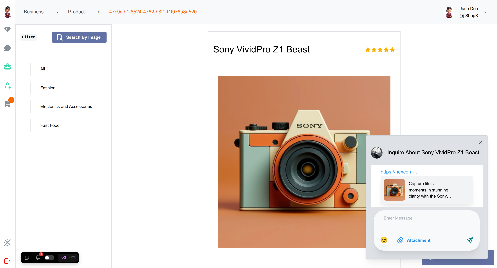

# Nexcom

A bridge between commerce and communication. Nexcom is a Next.js-powered super app that combines shopping, selling, and seamless communication within a single platform. The app leverages real-time technologies and AI to simplify transactions, enhance user experiences, and empower businesses.

## Table of Contents
- [Features](#features)
- [Tech Stack](#tech-stack)
- [Getting Started](#getting-started)
  - [Prerequisites](#prerequisites)
  - [Installation](#installation)
  - [Running Locally](#running-locally)
- [Environment Variables](#environment-variables)
- [Contributing](#contributing)
- [License](#license)


---

## Features
- **Real-time Communication**: Integrated chat and video calls between buyers and sellers.


- **Customizable Shops**: Easy setup for sellers to showcase products.


- **Streamlined Shopping**: Lightning-fast performance with intuitive navigation.


- **Scalable Backend**: Built for high-traffic environments with real-time WebSockets.



---

## Tech Stack
- **Frontend**: [Next.js](https://nextjs.org/), [React](https://react.dev/)
- **Backend**: [NestJS](https://nestjs.com/), WebSockets
- **Styling**: Tailwind CSS
- **Database**: MongoDB or PostgreSQL
- **Hosting**: Vercel

---

## Getting Started

### Prerequisites
- [Node.js](https://nodejs.org/) (v18+ recommended)
- npm or yarn
- Git installed locally

### Environment Variables
The following environment variables are required for the project:
* NEXT_PUBLIC_URL: URL for the backend API
* NEXT_PUBLIC_WS_URL: URL for the backend websocket API

``` 
NEXT_PUBLIC_URL=http://localhost:4000 
NEXT_PUBLIC_WS_URL=http://localhost:4000 
```
---
## Contributing
Contributions are currently not open. For inquiries, please contact the project owner.


---
## License

This project is licensed under the Proprietary License.

## Proprietary License Terms:
* You are NOT allowed to copy, modify, distribute, or use this code or any derivative works without explicit permission from the project owner.

* Commercial use, redistribution, or hosting of this project in any form is strictly prohibited.

For license inquiries, please contact mkmartinoes@gmail.com